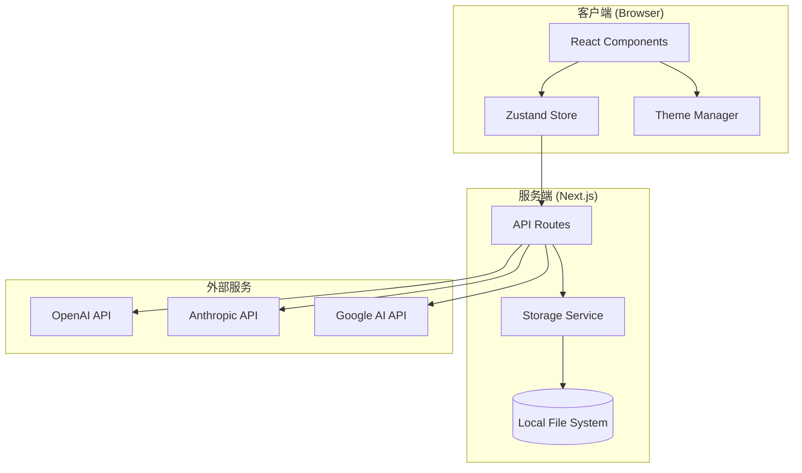

# Design Document: AI Chat Application

## Overview

本设计文档描述了基于 Next.js 14+ 和 Vercel AI SDK 5.x 的现代化 AI 聊天应用的技术架构和实现方案。应用采用 App Router 架构，支持多 AI 提供商切换、多对话管理、文件上传、流式响应、Markdown 渲染等功能。

### 技术栈

- **框架**: Next.js 14+ (App Router)
- **AI SDK**: Vercel AI SDK 5.x
- **前端**: React 18+, TypeScript
- **样式**: Tailwind CSS
- **Markdown**: react-markdown + remark-gfm + rehype-katex
- **代码高亮**: Prism.js 或 highlight.js
- **数学公式**: KaTeX
- **PDF 导出**: jsPDF + html2canvas

## Architecture



### 目录结构

```
src/
├── app/
│   ├── layout.tsx              # 根布局
│   ├── page.tsx                # 主页面
│   ├── globals.css             # 全局样式
│   └── api/
│       ├── chat/
│       │   └── route.ts        # AI 聊天 API
│       ├── conversations/
│       │   └── route.ts        # 对话管理 API
│       └── export/
│           └── route.ts        # 导出 API
├── components/
│   ├── chat/
│   │   ├── ChatContainer.tsx   # 聊天容器
│   │   ├── MessageList.tsx     # 消息列表
│   │   ├── MessageItem.tsx     # 单条消息
│   │   ├── MessageActions.tsx  # 消息操作按钮
│   │   ├── InputArea.tsx       # 输入区域
│   │   └── FileUploader.tsx    # 文件上传
│   ├── sidebar/
│   │   ├── Sidebar.tsx         # 侧边栏
│   │   ├── ConversationList.tsx # 对话列表
│   │   └── SearchBar.tsx       # 搜索栏
│   ├── markdown/
│   │   ├── MarkdownRenderer.tsx # Markdown 渲染
│   │   └── CodeBlock.tsx       # 代码块
│   ├── settings/
│   │   ├── SettingsPanel.tsx   # 设置面板
│   │   ├── ThemeSettings.tsx   # 主题设置
│   │   └── PromptSettings.tsx  # 提示词设置
│   └── ui/
│       ├── Button.tsx          # 按钮组件
│       ├── Select.tsx          # 下拉选择
│       ├── Modal.tsx           # 模态框
│       └── Toast.tsx           # 提示消息
├── hooks/
│   ├── useChat.ts              # 聊天 Hook
│   ├── useConversations.ts     # 对话管理 Hook
│   └── useTheme.ts             # 主题 Hook
├── lib/
│   ├── ai-providers.ts         # AI 提供商配置
│   ├── storage.ts              # 存储服务
│   └── utils.ts                # 工具函数
├── store/
│   └── index.ts                # Zustand 状态管理
└── types/
    └── index.ts                # TypeScript 类型定义
```

## Components and Interfaces

### 核心类型定义

```typescript
// types/index.ts

// AI 提供商类型
type AIProvider = 'openai' | 'anthropic' | 'google';

// AI 模型配置
interface AIModel {
  id: string;
  name: string;
  provider: AIProvider;
  supportsVision: boolean;
  supportsFiles: boolean;
}

// 消息类型
interface Message {
  id: string;
  role: 'user' | 'assistant' | 'system';
  content: string;
  attachments?: Attachment[];
  createdAt: Date;
}

// 附件类型
interface Attachment {
  id: string;
  type: 'image' | 'document';
  name: string;
  mimeType: string;
  data: string; // base64
  preview?: string; // 图片预览 URL
}

// 对话类型
interface Conversation {
  id: string;
  title: string;
  messages: Message[];
  model: string;
  systemPrompt?: string;
  isPinned: boolean;
  isArchived: boolean;
  createdAt: Date;
  updatedAt: Date;
}

// 主题配置
interface ThemeConfig {
  mode: 'light' | 'dark';
  primaryColor: string;
  fontSize: 'small' | 'medium' | 'large';
}

// 应用设置
interface AppSettings {
  globalSystemPrompt: string;
  theme: ThemeConfig;
  presetPrompts: PresetPrompt[];
}

// 预设提示词
interface PresetPrompt {
  id: string;
  name: string;
  prompt: string;
  icon: string;
}
```

### 状态管理 (Zustand)

```typescript
// store/index.ts
import { create } from 'zustand';
import { persist } from 'zustand/middleware';

interface ChatStore {
  // 对话状态
  conversations: Conversation[];
  currentConversationId: string | null;
  
  // 设置状态
  settings: AppSettings;
  
  // 对话操作
  createConversation: () => string;
  deleteConversation: (id: string) => void;
  updateConversation: (id: string, updates: Partial<Conversation>) => void;
  setCurrentConversation: (id: string) => void;
  pinConversation: (id: string) => void;
  archiveConversation: (id: string) => void;
  
  // 消息操作
  addMessage: (conversationId: string, message: Message) => void;
  updateMessage: (conversationId: string, messageId: string, content: string) => void;
  
  // 设置操作
  updateSettings: (settings: Partial<AppSettings>) => void;
  updateTheme: (theme: Partial<ThemeConfig>) => void;
}
```

### API 路由设计

#### 聊天 API (`/api/chat`)

```typescript
// app/api/chat/route.ts
import { streamText } from 'ai';
import { openai } from '@ai-sdk/openai';
import { anthropic } from '@ai-sdk/anthropic';
import { google } from '@ai-sdk/google';

export async function POST(request: Request) {
  const { messages, model, systemPrompt, attachments } = await request.json();
  
  // 根据模型选择提供商
  const provider = getProviderForModel(model);
  
  // 构建消息（包含附件）
  const formattedMessages = formatMessagesWithAttachments(messages, attachments);
  
  // 流式响应
  const result = await streamText({
    model: provider(model),
    system: systemPrompt,
    messages: formattedMessages,
  });
  
  return result.toDataStreamResponse();
}

function getProviderForModel(model: string) {
  if (model.startsWith('gpt')) return openai;
  if (model.startsWith('claude')) return anthropic;
  if (model.startsWith('gemini')) return google;
  throw new Error(`Unknown model: ${model}`);
}
```

#### 对话管理 API (`/api/conversations`)

```typescript
// app/api/conversations/route.ts
import { NextResponse } from 'next/server';
import { readConversations, writeConversation, deleteConversation } from '@/lib/storage';

// GET - 获取所有对话
export async function GET() {
  const conversations = await readConversations();
  return NextResponse.json(conversations);
}

// POST - 创建/更新对话
export async function POST(request: Request) {
  const conversation = await request.json();
  await writeConversation(conversation);
  return NextResponse.json({ success: true });
}

// DELETE - 删除对话
export async function DELETE(request: Request) {
  const { id } = await request.json();
  await deleteConversation(id);
  return NextResponse.json({ success: true });
}
```

### 存储服务设计

```typescript
// lib/storage.ts
import fs from 'fs/promises';
import path from 'path';

const STORAGE_DIR = process.env.CHAT_STORAGE_DIR || './data/conversations';

export async function readConversations(): Promise<Conversation[]> {
  await ensureStorageDir();
  const files = await fs.readdir(STORAGE_DIR);
  const conversations = await Promise.all(
    files
      .filter(f => f.endsWith('.json'))
      .map(async f => {
        const content = await fs.readFile(path.join(STORAGE_DIR, f), 'utf-8');
        return JSON.parse(content) as Conversation;
      })
  );
  return conversations.sort((a, b) => 
    new Date(b.updatedAt).getTime() - new Date(a.updatedAt).getTime()
  );
}

export async function writeConversation(conversation: Conversation): Promise<void> {
  await ensureStorageDir();
  const filePath = path.join(STORAGE_DIR, `${conversation.id}.json`);
  await fs.writeFile(filePath, JSON.stringify(conversation, null, 2));
}

export async function deleteConversation(id: string): Promise<void> {
  const filePath = path.join(STORAGE_DIR, `${id}.json`);
  await fs.unlink(filePath);
}

async function ensureStorageDir(): Promise<void> {
  await fs.mkdir(STORAGE_DIR, { recursive: true });
}
```

## Data Models

### 对话数据结构 (JSON 文件)

```json
{
  "id": "conv_abc123",
  "title": "关于 React Hooks 的讨论",
  "messages": [
    {
      "id": "msg_001",
      "role": "user",
      "content": "请解释 useEffect 的工作原理",
      "attachments": [],
      "createdAt": "2024-01-15T10:30:00Z"
    },
    {
      "id": "msg_002",
      "role": "assistant",
      "content": "useEffect 是 React 的一个 Hook...",
      "createdAt": "2024-01-15T10:30:05Z"
    }
  ],
  "model": "gpt-4o",
  "systemPrompt": "你是一个专业的前端开发专家",
  "isPinned": false,
  "isArchived": false,
  "createdAt": "2024-01-15T10:30:00Z",
  "updatedAt": "2024-01-15T10:35:00Z"
}
```

### 设置数据结构 (localStorage)

```json
{
  "globalSystemPrompt": "你是一个有帮助的 AI 助手",
  "theme": {
    "mode": "light",
    "primaryColor": "#667eea",
    "fontSize": "medium"
  },
  "presetPrompts": [
    {
      "id": "translator",
      "name": "翻译助手",
      "prompt": "你是一个专业的翻译助手，擅长中英文互译",
      "icon": "🌐"
    },
    {
      "id": "coder",
      "name": "代码专家",
      "prompt": "你是一个资深的软件工程师，擅长代码审查和优化",
      "icon": "💻"
    },
    {
      "id": "writer",
      "name": "写作助手",
      "prompt": "你是一个专业的写作助手，擅长文章润色和创作",
      "icon": "✍️"
    }
  ]
}
```

### AI 模型配置

```typescript
// lib/ai-providers.ts
export const AI_MODELS: AIModel[] = [
  // OpenAI
  {
    id: 'gpt-4o',
    name: 'GPT-4o',
    provider: 'openai',
    supportsVision: true,
    supportsFiles: true,
  },
  {
    id: 'gpt-4o-mini',
    name: 'GPT-4o Mini',
    provider: 'openai',
    supportsVision: true,
    supportsFiles: true,
  },
  // Anthropic
  {
    id: 'claude-3-5-sonnet-20241022',
    name: 'Claude 3.5 Sonnet',
    provider: 'anthropic',
    supportsVision: true,
    supportsFiles: true,
  },
  {
    id: 'claude-3-haiku-20240307',
    name: 'Claude 3 Haiku',
    provider: 'anthropic',
    supportsVision: true,
    supportsFiles: false,
  },
  // Google
  {
    id: 'gemini-1.5-pro',
    name: 'Gemini 1.5 Pro',
    provider: 'google',
    supportsVision: true,
    supportsFiles: true,
  },
  {
    id: 'gemini-1.5-flash',
    name: 'Gemini 1.5 Flash',
    provider: 'google',
    supportsVision: true,
    supportsFiles: true,
  },
];
```


## Correctness Properties

*A property is a characteristic or behavior that should hold true across all valid executions of a system—essentially, a formal statement about what the system should do. Properties serve as the bridge between human-readable specifications and machine-verifiable correctness guarantees.*

### Property 1: Model Selection Affects API Requests

*For any* model selection in the Model_Selector, when a message is sent, the API request SHALL contain the selected model ID.

**Validates: Requirements 1.2, 1.5**

### Property 2: Conversation History Preserved on Model Switch

*For any* conversation with existing messages, when the user switches to a different model, the messages array SHALL remain unchanged.

**Validates: Requirements 1.3**

### Property 3: Model Routing to Correct Provider

*For any* valid model ID, the `getProviderForModel` function SHALL return the correct AI provider (OpenAI for gpt-*, Anthropic for claude-*, Google for gemini-*).

**Validates: Requirements 1.4**

### Property 4: File Type Validation

*For any* file upload:
- Files with extensions in [jpg, jpeg, png, gif, webp, pdf, txt, doc, docx] SHALL be accepted
- Files with extensions NOT in the allowed list SHALL be rejected with an error message

**Validates: Requirements 2.1, 2.2**

### Property 5: File Size Validation

*For any* file upload, if the file size exceeds 15MB (15 * 1024 * 1024 bytes), the File_Uploader SHALL reject the file.

**Validates: Requirements 2.3**

### Property 6: File Preview Display

*For any* attached file:
- If the file type is 'image', a thumbnail preview SHALL be displayed
- If the file type is 'document', the file name SHALL be displayed

**Validates: Requirements 2.4**

### Property 7: File to Base64 Conversion

*For any* file attachment in a message, the API request SHALL contain the file data encoded as a valid base64 string.

**Validates: Requirements 2.5**

### Property 8: Conversation Storage Round-Trip

*For any* valid Conversation object, writing it to storage and then reading it back SHALL produce an equivalent Conversation object (id, title, messages, model, systemPrompt, isPinned, isArchived match).

**Validates: Requirements 6.1, 6.2, 6.3, 6.4**

### Property 9: Title Generation Constraints

*For any* generated conversation title:
- The title length SHALL be <= 50 characters
- The title SHALL be non-empty
- The title SHALL be persisted with the conversation

**Validates: Requirements 7.1, 7.2, 7.3**

### Property 10: Markdown Rendering Correctness

*For any* Markdown input string containing valid Markdown syntax:
- Headings (# ## ###) SHALL produce corresponding h1, h2, h3 elements
- Bold (**text**) SHALL produce strong elements
- Italic (*text*) SHALL produce em elements
- Lists (- or 1.) SHALL produce ul/ol and li elements
- Links ([text](url)) SHALL produce anchor elements with href
- Tables SHALL produce table, thead, tbody, tr, td elements
- Blockquotes (>) SHALL produce blockquote elements

**Validates: Requirements 8.1, 8.2, 8.3, 8.4, 8.5**

### Property 11: Code Block Rendering

*For any* code block in the format ```language\ncode\n```:
- The output SHALL contain syntax highlighting CSS classes
- The output SHALL contain line numbers
- The output SHALL display the language label

**Validates: Requirements 9.1, 9.2, 9.3**

### Property 12: LaTeX Rendering

*For any* LaTeX expression:
- Inline LaTeX ($...$) SHALL be rendered inline within the text flow
- Block LaTeX ($$...$$) SHALL be rendered as a centered block element

**Validates: Requirements 10.1, 10.2**

### Property 13: System Prompt Usage in API

*For any* API request:
- If the conversation has a specific systemPrompt, that prompt SHALL be used
- If the conversation has no specific systemPrompt, the global systemPrompt SHALL be used
- The system prompt SHALL be included in the API request to the AI provider

**Validates: Requirements 11.4, 11.5**

### Property 14: Settings Persistence

*For any* user settings change (theme mode, primary color, font size):
- After changing the setting and reloading the application, the setting SHALL retain its changed value

**Validates: Requirements 13.3, 14.3, 15.3**

### Property 15: Export Format Correctness

*For any* conversation export:
- Markdown export SHALL produce valid Markdown that can be parsed
- JSON export SHALL produce valid JSON that can be parsed back to an equivalent Conversation object
- The exported filename SHALL contain the conversation title and export date

**Validates: Requirements 16.1, 16.2, 16.4**

### Property 16: Media Download Button Presence

*For any* AI message containing generated media (image or video), the Message_Container SHALL render a download button for that media.

**Validates: Requirements 17.1, 17.2**

### Property 17: Sidebar Conversation Display and Filtering

*For any* set of conversations:
- All non-archived conversations SHALL be displayed in the Sidebar
- Pinned conversations SHALL appear before unpinned conversations
- When a search query is entered, only conversations with titles containing the query SHALL be displayed

**Validates: Requirements 5.1, 5.6, 5.7**

### Property 18: Conversation Operations

*For any* conversation:
- After deletion, the conversation SHALL NOT exist in the conversations list
- After archiving, the conversation's isArchived property SHALL be true
- After pinning, the conversation's isPinned property SHALL be true

**Validates: Requirements 5.4, 5.5, 5.6**

### Property 19: Input Field Height Constraint

*For any* text input in the message input field, the field height SHALL NOT exceed 120px regardless of content length.

**Validates: Requirements 19.3**

### Property 20: Message Action Buttons

*For any* AI message in the Message_Container, action buttons (copy, regenerate) SHALL be rendered at the bottom of the message.

**Validates: Requirements 12.4**

## Error Handling

### API 错误处理

| 错误类型 | HTTP 状态码 | 用户提示 | 处理方式 |
|---------|------------|---------|---------|
| API 密钥缺失 | 401 | "API 配置错误，请联系管理员" | 显示错误提示 |
| API 密钥无效 | 401 | "API 认证失败" | 显示错误提示 |
| 模型不支持 | 400 | "所选模型暂不可用" | 提示切换模型 |
| 请求超时 | 504 | "请求超时，请重试" | 允许重试 |
| 流式连接中断 | - | "连接中断，请重试" | 允许重试 |
| 速率限制 | 429 | "请求过于频繁，请稍后重试" | 显示倒计时 |

### 文件处理错误

| 错误类型 | 用户提示 | 处理方式 |
|---------|---------|---------|
| 文件类型不支持 | "不支持的文件类型：{type}" | 拒绝上传 |
| 文件过大 | "文件大小超过 15MB 限制" | 拒绝上传 |
| 文件读取失败 | "文件读取失败，请重试" | 允许重试 |

### 存储错误

| 错误类型 | 处理方式 |
|---------|---------|
| 存储目录不存在 | 自动创建目录 |
| 文件写入失败 | 重试 3 次，失败后提示用户 |
| 文件读取失败 | 跳过损坏文件，记录日志 |
| JSON 解析失败 | 跳过损坏文件，记录日志 |

## Testing Strategy

### 测试框架

- **单元测试**: Vitest
- **组件测试**: React Testing Library
- **端到端测试**: Playwright
- **属性测试**: fast-check

### 测试类型

#### 单元测试

- 工具函数测试 (utils.ts)
- 存储服务测试 (storage.ts)
- AI 提供商路由测试 (ai-providers.ts)
- 状态管理测试 (store)

#### 组件测试

- MessageItem 渲染测试
- FileUploader 交互测试
- Sidebar 过滤测试
- MarkdownRenderer 输出测试
- CodeBlock 高亮测试

#### 属性测试 (Property-Based Testing)

使用 fast-check 库实现属性测试，每个测试运行至少 100 次迭代。

**测试标签格式**: `Feature: ai-chat-app, Property {number}: {property_text}`

关键属性测试：
1. 对话存储 round-trip (Property 8)
2. Markdown 渲染正确性 (Property 10)
3. 文件类型验证 (Property 4)
4. 文件大小验证 (Property 5)
5. 标题生成约束 (Property 9)
6. 导出格式正确性 (Property 15)

#### 集成测试

- API 路由与 AI 提供商集成
- 前端与后端 API 集成
- 存储服务与文件系统集成

#### 端到端测试

- 完整对话流程
- 文件上传流程
- 主题切换流程
- 导出功能流程

### 测试覆盖目标

- 单元测试覆盖率: >= 80%
- 关键路径 E2E 测试覆盖
- 所有属性测试通过
